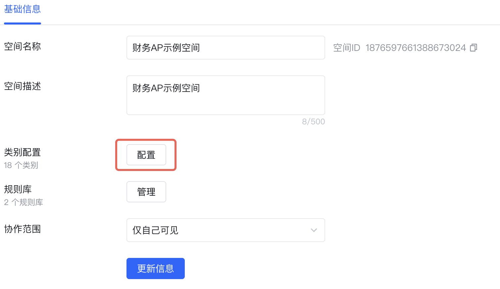
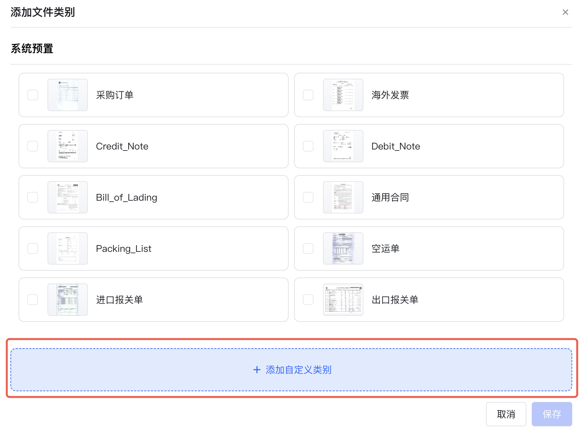
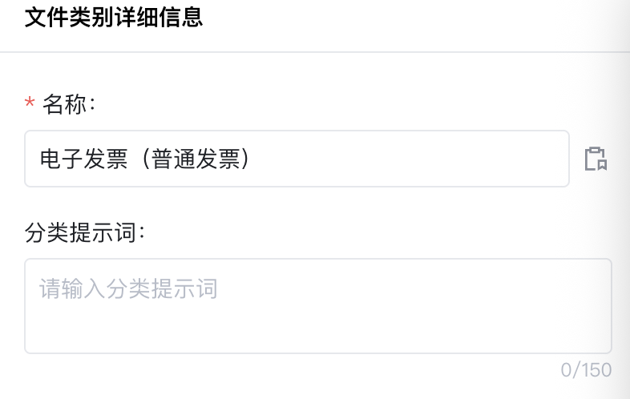
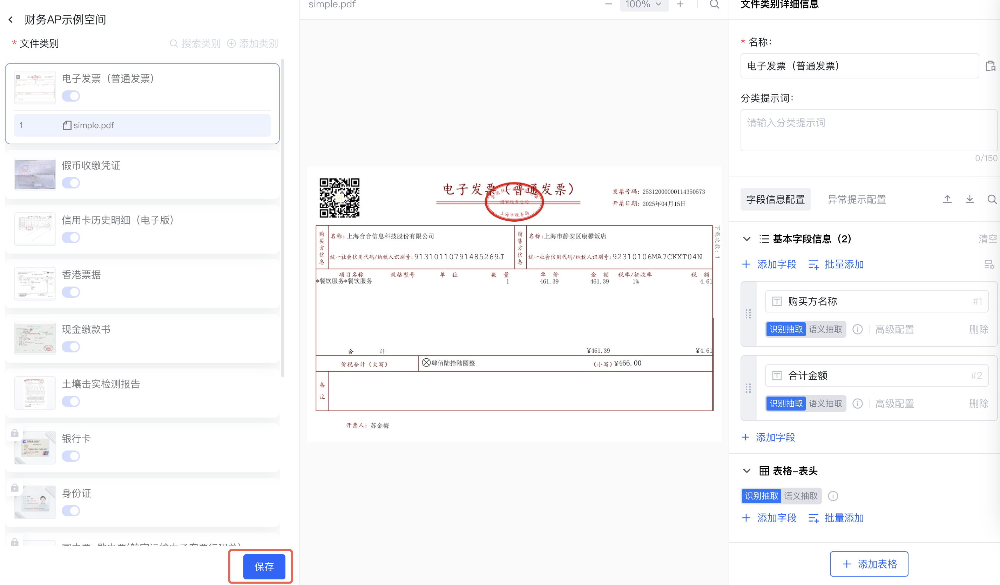

## 类别配置页入口

1. 在空间列表，选择工作空间-点击**更多操作-设置**

2. 在弹出的滑窗上，点击类别**配置**，进入文件类别配置页

## 添加类别示例样本

1. 点击**添加类别**

2. 点击**添加自定义类别**, 上传文件

## 配置分类名称

设置分类名称

## 配置样本字段

点击**自动添加字段**，将由AI根据文档自动添加字段

也可以手动添加、调整和删除字段

## 保存配置

点击**保存**

