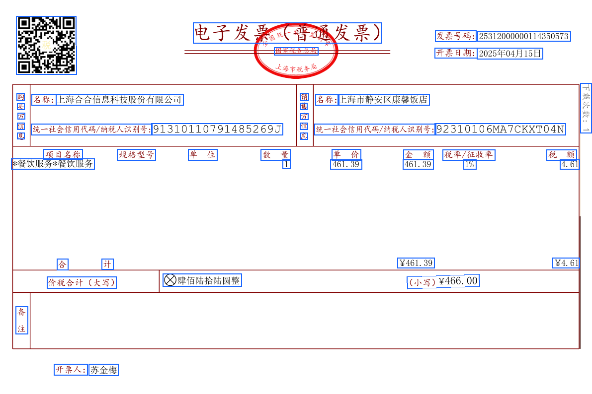

<Tip>
  This document continues from the [previous section](./quickstart), explaining how to process parsing results after obtaining them and draw text boxes at corresponding positions on the original file.
</Tip>

<Tip>
  This document uses [this sample document](https://dllf.intsig.net/download/2025/Solution/20250829/simple.pdf) as an example to explain how to draw text boxes on the original file image.
</Tip>

<Tip>
  Please install dependencies before running the example code:
  `pip install PyMuPDF pillow requests`
</Tip>

## Example Code

<CodeGroup>

```python Python expandable icon=python lines
import requests
import json
import os
import fitz  # PyMuPDF
from PIL import Image, ImageDraw

ti_app_id = "your_app_id"
ti_secret_code = "your_app_secret"
workspace_id = "your_workspace_id"
file_id = "your_file_id"

host = "https://docflow.textin.ai"
url = "/api/app-api/sip/platform/v2/file/fetch"
params = {
    "workspace_id":workspace_id, 
    "with_document": "true", 
    "file_id":file_id
    }
resp = requests.get(url=f"{host}{url}", 
                    params=params,
                    headers={"x-ti-app-id": ti_app_id,
                             "x-ti-secret-code": ti_secret_code,
                             })
resp_json = json.loads(resp.text)

def extract_pages_from_docflow(document):
    pages_out = []
    for page in document.get("pages", []):
        pages_out.append({
            "width": page.get("width", 0),
            "height": page.get("height", 0),
            "angle": page.get("angle", 0),
            "lines": page.get("lines", [])
        })
    return pages_out

def pdf_to_images(pdf_path, output_dir="./docflow_pages", dpi=144):
    os.makedirs(output_dir, exist_ok=True)
    doc = fitz.open(pdf_path)
    zoom = dpi / 72.0
    mat = fitz.Matrix(zoom, zoom)
    image_paths = []
    for i, page in enumerate(doc):
        pix = page.get_pixmap(matrix=mat)
        img_path = os.path.join(output_dir, f"page_{i+1}.png")
        pix.save(img_path)
        image_paths.append(img_path)
    doc.close()
    return image_paths

def draw_quads_on_image(image_path, quads, page_width, page_height, color=(26,102,255), line_width=2):
    image = Image.open(image_path).convert("RGB")
    draw = ImageDraw.Draw(image)
    img_w, img_h = image.size
    scale_x = img_w / page_width if page_width else 1
    scale_y = img_h / page_height if page_height else 1
    for q in quads:
        pos = q.get("position")
        if pos and len(pos) == 8:
            points = [
                (pos[0]*scale_x, pos[1]*scale_y),
                (pos[2]*scale_x, pos[3]*scale_y),
                (pos[4]*scale_x, pos[5]*scale_y),
                (pos[6]*scale_x, pos[7]*scale_y),
                (pos[0]*scale_x, pos[1]*scale_y)
            ]
            draw.line(points, fill=color, width=line_width)
    out_path = image_path.replace('.png', '_boxed.png')
    image.save(out_path)
    return out_path

# Select the original PDF to visualize (same file as parsed)
pdf_path = "./simple.pdf"  # Please replace with your original PDF path

# Extract coordinate data
files = resp_json.get("result", {}).get("files", [])
if not files:
    raise RuntimeError("No file parsing results obtained")
document = files[0].get("document", {})
pages = extract_pages_from_docflow(document)

# Convert to images and draw coordinates
image_paths = pdf_to_images(pdf_path, output_dir="./docflow_pages")
annotated = []
for i, page in enumerate(pages):
    if i >= len(image_paths):
        break
    out_path = draw_quads_on_image(
        image_paths[i],
        page["lines"],
        page["width"],
        page["height"]
    )
    annotated.append(out_path)

print("Annotated images output:", annotated)
```

</CodeGroup>

In the output directory, you can see the rendering effect of text boxes:



## Example Code Logic

- **Get parsing results**: Call the result retrieval interface with `with_document=true` enabled to get `result.files[].document`.
- **Extract pages and coordinates**: Read `width/height/angle` and `lines[]` from `document.pages[]`; each `line.position` is `[x1,y1,x2,y2,x3,y3,x4,y4]` clockwise four-point coordinates.
- **Prepare base image**: Use the same file as parsing to generate page images. If converting images yourself, remember to record the rendered `img_width/img_height`.
- **Coordinate scaling**: Calculate `scale_x = img_width / page.width`, `scale_y = img_height / page.height`, and scale the returned coordinates proportionally to the base image pixel coordinate system.
- **Draw visualization**: Draw the scaled four points as closed polylines (or filled polygons) on the corresponding page image line by line, with configurable line width, color, and transparency.
- **Output and display**: Save annotated images, or overlay rendering in frontend canvas/SVG/Canvas; ensure page-by-page correspondence.
- **Optional enhancements**:
  - Handle `angle` rotation: If the base image is not rotated correctly, coordinate rotation correction based on `page.angle` is needed.
  - Multi-type coloring: Different element types can use different colors/legends; if there are table, image, and other types, they can be differentiated as needed.
  - Character-level highlighting: If `charPositions` is returned, scale each character coordinate proportionally and draw for more refined echo effects.
  - Performance optimization: Batch drawing, resolution trade-offs, on-demand page rendering to avoid processing too many pages at once causing lag.
  - Robustness: Null value checking, coordinate boundary clipping, fault tolerance for network/parsing exceptions.

The above process is language-agnostic. When implementing in other languages, you only need to replace the libraries and APIs for: HTTP requests, JSON parsing, image drawing, and coordinate scaling.