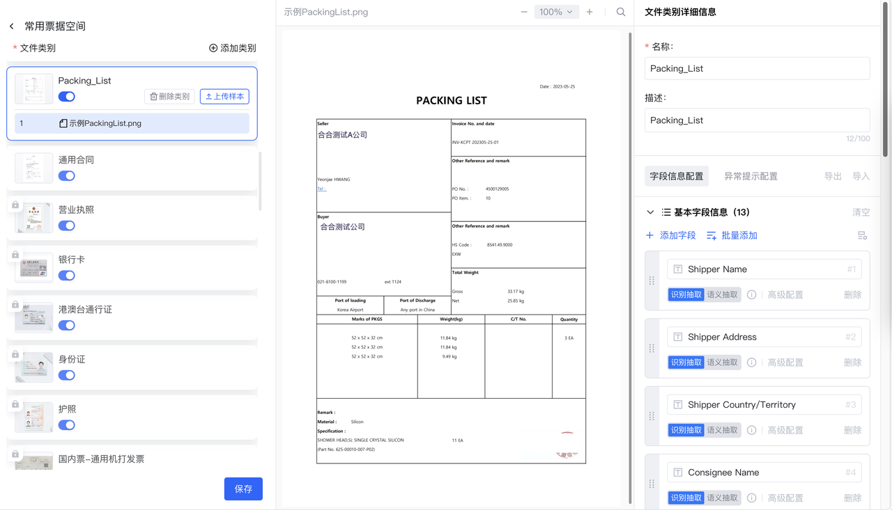

## 01 产品概述

**Docflow 文档自动化平台**，是合合信息TextIn推出的AI驱动的企业级文档自动化处理平台。

依托合合信息行业领先的文档解析与文档理解能力，支持海内外各类版式文档的 **智能采集**、**文档解析**、**文档分类**、**信息抽取**及 **智能审核**，为银行信贷、财务共享中心、物流通关、保险理赔等行业企业提供高效、准确的文档处理解决方案。通过稳定易用的 API ，您可以在各类业务系统中高效集成 DocFlow，实现从文档采集到信息提取的全流程自动化，显著降低人工录入与审核成本。

## 02 核心价值

在信息爆炸的时代，企业每天都需要处理海量的合同、发票、报告、申请单等各类文档。传统人工方式不仅耗时耗力，还容易出错。**Docflow 文档自动化平台**，助力企业轻松应对文档管理挑战，大幅提高工作效率与数据准确性。

### 2.1 全流程自动化

- 从文件上传到结果获取，全程由系统智能完成，几乎零人工干预，极大提升文档处理效率。

### 2.2 高效精准提取

- 海量文档秒速解析抽取，极大缩短处理周期，提升文档处理效率。
- 基于专研大模型能力，通过优化图像质量、智能分析文档结构等文档预处理机制，极大提升识别精度，满足不同场景下的文档处理需求。

### 2.3 智能文档拆分

- 对混合扫描的多类别多份复杂文件，以及混贴多张票据的单页文档，自动完成文档切分、类别拆分并识别，有效降低人工拆分成本，提升文档处理效果。

### 2.4 智能文档审核

- 基于文档提取信息与审核规则共同实现自动化文档审核，审核结果支持关键审核依据回显，有效提升审核结果复核效率。

### 2.5 多文档格式兼容

- 支持1000页超长文档处理
- 支持JPEG, JPG, PNG, PDF, OFD，DOC, DOCX、XLS、XLSX、TXT等文件格式。

### 2.6 按需定制，开箱即用

- 个性化配置：通过自定义上传样本并配置字段，系统智能识别文件类别并完成结构化信息抽取
- 高效对比复核：支持原文件与识别结果对比查看，确保信息复核与补录，满足不同行业个性化需求。

### 2.7 强大的插件集成能力

- 支持通过扫描仪、邮件、API接口等多种渠道接收文档，并将提取数据无缝传递至ERP、RPA、OMS等各种自动化系统和业务流程中。

## 03 使用流程

**Docflow 文档自动化平台**旨在简化文档管理流程，提高企业文档处理效率。企业仅需完成类别信息配置，即可实现文档自动化处理流程，具体流程说明如下：

### 3.1 工作空间创建

用户完成登录后，可根据不同业务场景创建相应的工作空间，用于管理不同业务场景下的文件类别及文档。

### 3.2 文件类别配置

完成空间创建后，用户可选择指定业务空间，并根据业务场景需求进行以下配置，帮助系统实现更精准的自动分类和字段抽取：

1. 创建文件类别并上传样本
2. 维护文件类别分类提示词、字段抽取信息等

   

### 3.3 文件上传

完成空间创建及文件类别配置后，用户可通过系统平台或API接口将需要处理的文档上传至指定工作空间。我们支持多种文件格式文档自动化处理，包括但不限于JPEG, JPG, PNG, PDF, OFD，DOC, DOCX、XLS、XLSX、TXT等。

### 3.4 文档解析

Docflow 采用[xParse](https://www.textin.com/market/detail/pdf_to_markdown)作为核心文档解析服务，能够自动将用户上传后的 PDF、Word 以及常见图片等格式文档，精准转换为包含文本、表格、标题层级、公式、手写字符和图片信息的结构化数据，便于后续的自动化处理与分析。

### 3.5 文件拆分&多图切分

在实际应用场景中，一份文档可能包含多种文件类型，DocFlow 提供文件拆分和多图切分功能，用户可通过系统平台或API接口自定义启用相关功能，以确保文档分类抽取内容的准确性和完整性。例如：

1. 保险理赔场景：一份多页 PDF 可能同时包含身份证、发票、银行流水等材料，需对文档进行分页拆分处理。
2. 财务报销场景：一张 A4 纸上可能平铺多张出租车发票、飞机行程单等票据，需对文档图像进行切分处理。

   

### 3.6 文档分类

DocFlow 根据空间文件类别配置信息，对解析后的文档进行自动分类，方便用户快速查找和管理，以及后续的信息抽取和审核，用户也可通过 API接口获取分类结果应用于其他下游场景。

### 3.7 信息抽取

DocFlow 根据空间文件类别配置的字段信息，对解析分类后的文档进行自动抽取展示。用户可通过系统平台或API接口获取文档抽取结果。

### 3.8 智能审核

用户可通过系统平台或API接口创建维护空间审核规则，并发起审核任务。DocFlow 将根据文档解析抽取结果及审核规则，对审核任务文件进行批量规则审核，并输出审核结果。

## 04 立即体验

<CardGroup cols={2}>
  <Card title="SaaS平台" icon="sparkles" href="https://docflow.textin.com/">
    一站式极速体验文档自动化处理流程
  </Card>
  <Card title="API" icon="sparkles" href="/api-reference/%E4%B8%8A%E4%BC%A0%E6%96%87%E4%BB%B6">
    灵活使用不同编程语言，支持接口高度自定义
  </Card>
  <Card title="Docflow 官方网站" icon="sparkles" href="https://www.textin.com/product/textin_docflow">
    更丰富的产品资讯，欢迎点击了解
  </Card>
  <Card title="联系我们" icon="sparkles" href="https://www.textin.com/contact?type=27&sub_type=1">
    更多合作信息，欢迎咨询
  </Card>
</CardGroup>