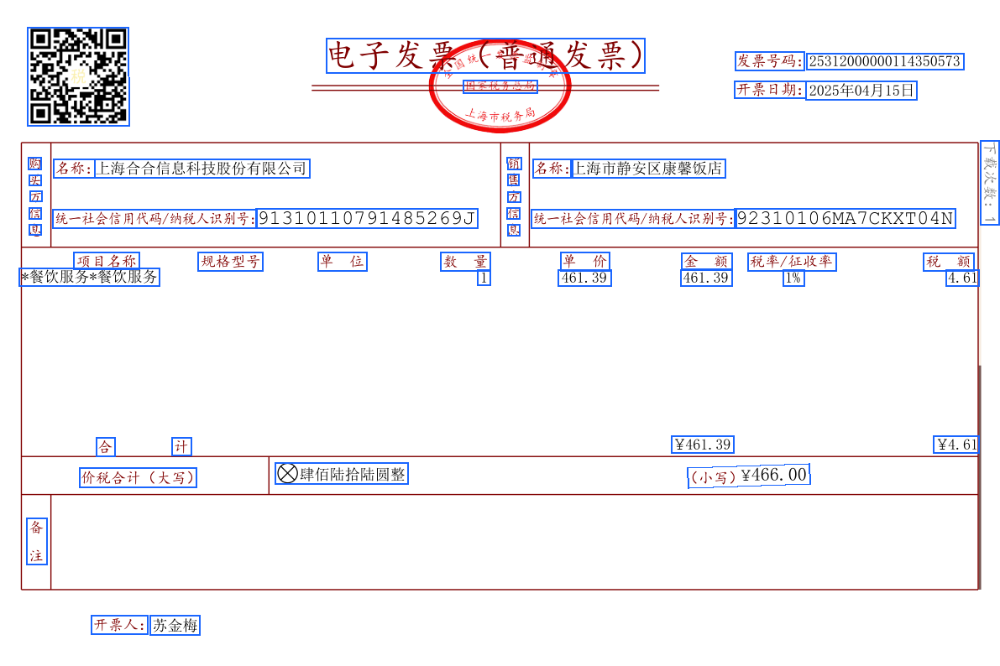

<Tip>
本文档接着[上一节](./quickstart)，说明在获得解析结果后，如何处理解析结果，并在原文件上相应位置画出文本框。
</Tip>
<Tip>
本文档以[此示例样本](https://dllf.intsig.net/download/2025/Solution/20250829/simple.pdf)为例。说明如何将文本框绘制于原文件图像上。
</Tip>

<Tip>
运行示例代码前请先安装依赖：
`pip install PyMuPDF pillow requests`
</Tip>

## 示例代码

<CodeGroup>

```python Python icon=python expandable lines
import requests
import json
import os
import fitz  # PyMuPDF
from PIL import Image, ImageDraw

ti_app_id = "your_app_id"
ti_secret_code = "your_app_secret"
workspace_id = "your_workspace_id"
file_id = "your_file_id"

host = "https://docflow.textin.ai"
url = "/api/app-api/sip/platform/v2/file/fetch"
params = {
    "workspace_id":workspace_id, 
    "with_document": "true", 
    "file_id":file_id
    }
resp = requests.get(url=f"{host}{url}", 
                    params=params,
                    headers={"x-ti-app-id": ti_app_id,
                             "x-ti-secret-code": ti_secret_code,
                             })
resp_json = json.loads(resp.text)

def extract_pages_from_docflow(document):
    pages_out = []
    for page in document.get("pages", []):
        pages_out.append({
            "width": page.get("width", 0),
            "height": page.get("height", 0),
            "angle": page.get("angle", 0),
            "lines": page.get("lines", [])
        })
    return pages_out

def pdf_to_images(pdf_path, output_dir="./docflow_pages", dpi=144):
    os.makedirs(output_dir, exist_ok=True)
    doc = fitz.open(pdf_path)
    zoom = dpi / 72.0
    mat = fitz.Matrix(zoom, zoom)
    image_paths = []
    for i, page in enumerate(doc):
        pix = page.get_pixmap(matrix=mat)
        img_path = os.path.join(output_dir, f"page_{i+1}.png")
        pix.save(img_path)
        image_paths.append(img_path)
    doc.close()
    return image_paths

def draw_quads_on_image(image_path, quads, page_width, page_height, color=(26,102,255), line_width=2):
    image = Image.open(image_path).convert("RGB")
    draw = ImageDraw.Draw(image)
    img_w, img_h = image.size
    scale_x = img_w / page_width if page_width else 1
    scale_y = img_h / page_height if page_height else 1
    for q in quads:
        pos = q.get("position")
        if pos and len(pos) == 8:
            points = [
                (pos[0]*scale_x, pos[1]*scale_y),
                (pos[2]*scale_x, pos[3]*scale_y),
                (pos[4]*scale_x, pos[5]*scale_y),
                (pos[6]*scale_x, pos[7]*scale_y),
                (pos[0]*scale_x, pos[1]*scale_y)
            ]
            draw.line(points, fill=color, width=line_width)
    out_path = image_path.replace('.png', '_boxed.png')
    image.save(out_path)
    return out_path

# 选择要可视化的原始PDF（与解析的同一文件）
pdf_path = "./simple.pdf"  # 请替换为你的原始PDF路径

# 提取坐标数据
files = resp_json.get("result", {}).get("files", [])
if not files:
    raise RuntimeError("未获取到文件解析结果")
document = files[0].get("document", {})
pages = extract_pages_from_docflow(document)

# 转图片并绘制坐标
image_paths = pdf_to_images(pdf_path, output_dir="./docflow_pages")
annotated = []
for i, page in enumerate(pages):
    if i >= len(image_paths):
        break
    out_path = draw_quads_on_image(
        image_paths[i],
        page["lines"],
        page["width"],
        page["height"]
    )
    annotated.append(out_path)

print("标注图片输出:", annotated)
```
</CodeGroup>

在输出目录中，可以看到文本框的渲染效果：


## 示例代码思路
 
- **获取解析结果**: 调用获取结果接口并开启 `with_document=true`，拿到 `result.files[].document`。
- **提取页面与坐标**: 从 `document.pages[]` 读取 `width/height/angle` 和 `lines[]`；每个 `line.position` 为 `[x1,y1,x2,y2,x3,y3,x4,y4]` 顺时针四点坐标。
- **准备底图**: 使用与解析同一文件生成页面图像。若自行转图，需记录渲染后的 `img_width/img_height`。
- **坐标缩放**: 计算 `scale_x = img_width / page.width`，`scale_y = img_height / page.height`，将返回的坐标按比例缩放到底图像素坐标系。
- **绘制可视化**: 逐行将缩放后的四点以折线闭合（或填充多边形）绘制到对应页图像上，可设置线宽、颜色与透明度。
- **输出与展示**: 保存标注后的图片，或在前端画布/SVG/Canvas 中叠加渲染；注意按页一一对应。
- **可选增强**:
  - 处理 `angle` 旋转：若底图未旋正，需要根据 `page.angle` 做坐标旋转修正。
  - 多类型着色：不同元素类型可用不同颜色/图例；若有表格、图片等类型，可按需区分。
  - 字符级高亮：若返回 `charPositions`，对每个字符坐标同样按比例缩放并绘制，获得更精细的回显效果。
  - 性能优化：批量绘制、分辨率权衡、按需分页渲染，避免一次性处理过多页面造成卡顿。
  - 健壮性：空值校验，坐标越界裁剪，容错处理网络/解析异常。

以上流程与具体编程语言无关，其他语言实现时仅需替换：HTTP 请求、JSON 解析、图像绘制与坐标缩放这三个部分的库与API即可。