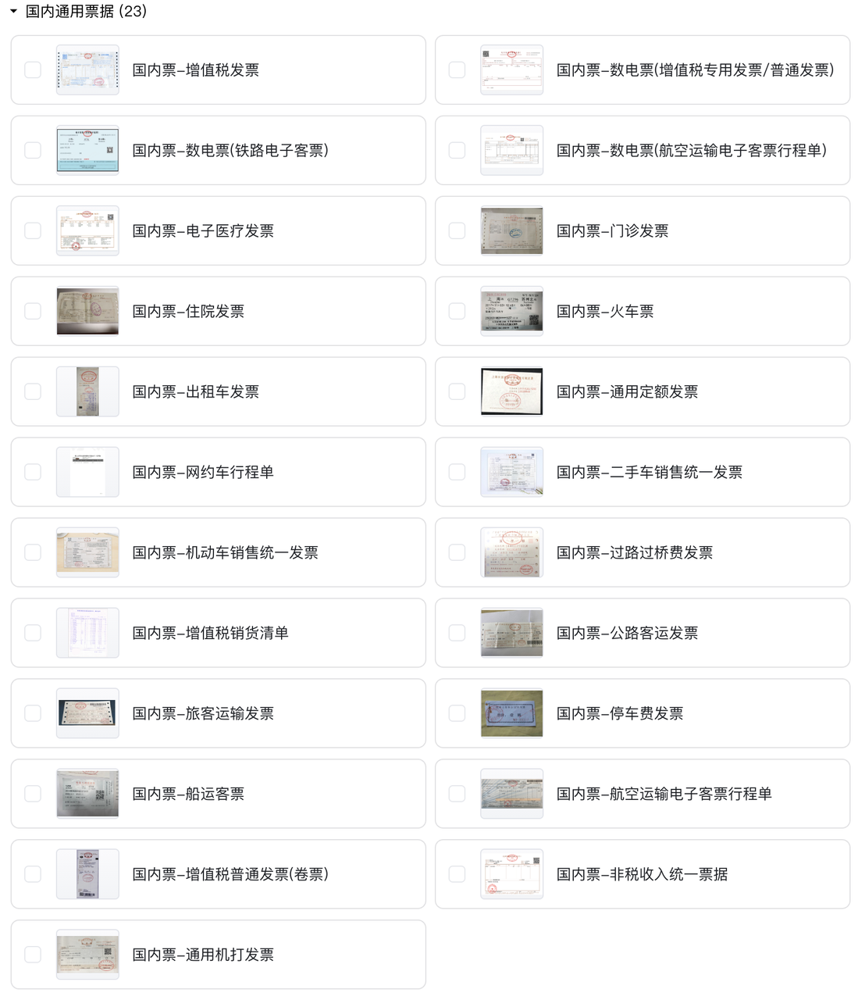
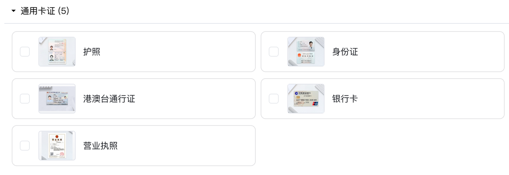

## 01 产品规格与充值

您可以通过TextIn 官网，访问 “[DocFlow 文档自动化-产品规格](https://www.textin.com/product/textin_docflow)” 查看详细的产品定价信息，并进行 T 币充值操作，以满足您的使用需求。

## 02 资费查询

在使用过程中，您可以在工作台的“[充值与消费明细](https://www.textin.com/console/dashboard/userCenter/finance)”板块，清晰地查看到 T 币的订单记录以及消费情况，方便您随时掌握账户的资金动态。

## 03 计费规则

DocFlow 文档自动化平台采用简洁明了的“按页计费”模式，计费单位为“T 币/页”，您可以根据自身需求直接充值 T 币，灵活使用平台的各项功能。平台提供三种使用方式，分别是 SaaS 平台使用、API 使用和私有化部署使用，以下是针对这三种使用方式的具体计费说明：

### 3.1 SaaS平台

您可以通过点击“[Docflow 文档自动化平台](https://docflow.textin.ai/)”访问 SaaS 平台产品，其计费规则如下：

#### **1、文件处理计费**

文件上传后，系统将依据首次成功分类的页数计费。若部分文件或页面在首次上传时未成功分类（被归为 undefined 分类），则不会进行计费。但如果后续您通过重新识别等操作使这些文件分类成功，那么将按照首次分类成功的页数进行计费。不同文件类型计费标准如下：

（1）国内通用票据：0.1 元/页，目前涵盖以下23种票据类型

（2）标准卡证：0.1 元/页，目前涵盖以下5种卡证类型

（3）其他文件类型：0.3 元/页

#### 2、发票验真计费

发票验真服务的计费标准为 0.2 元/次，按照发起次数进行计费。若需使用此服务，请提前联系商务开通

#### 3、其他操作计费

（1）使用文件拆分、多图切分功能时，不会对同一内容进行重复计费，避免您因功能使用而产生不必要的费用支出。

（2）对于已经计费的页面，后续进行的诸如重新识别、修改分类、字段修正、智能审核等操作，均不会再产生额外的计费，确保您在使用过程中的费用清晰可控。

文档自动化处理成功后，您可以通过空间文件列表查询历史处理结果。

### 3.2 API 接口

通过 API 接口调用平台功能时，其计费逻辑与 SaaS 平台保持一致，即按照上述 SaaS 平台的计费规则执行。若 API 请求失败，则不会产生任何计费，确保您在接口调用过程中的费用安全。

### 3.3 私有化部署

如果您有私有化部署的需求，我们提供了三种灵活的付费方案：

1. 一次性买断
2. 按年付费
3. 按用量付费

您可以根据自身企业的实际需求和预算情况选择合适的方案。具体的付费细节和方案内容，可通过联系我们的商务团队进行详细咨询和接洽，我们将为您提供一对一的专业服务，确保您能够找到最适合您的私有化部署付费方式。

## 04 新用户福利

我们为每位新注册的用户赠送 50 页 DocFlow 文档自动化平台免费使用额度，助力您快速体验产品功能。

此外，添加 TextIn 福利官，还可额外获得 1000 页（次）TextIn 产品使用额度及其他诸多福利，让您能够更全面地探索 DocFlow 在实际业务场景中的应用效果。

当免费额度使用完毕后，您需要通过[充值T币](https://www.textin.com/console/dashboard/userCenter/charge) 来继续使用平台服务。