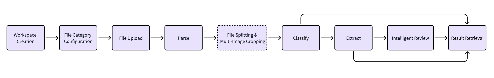
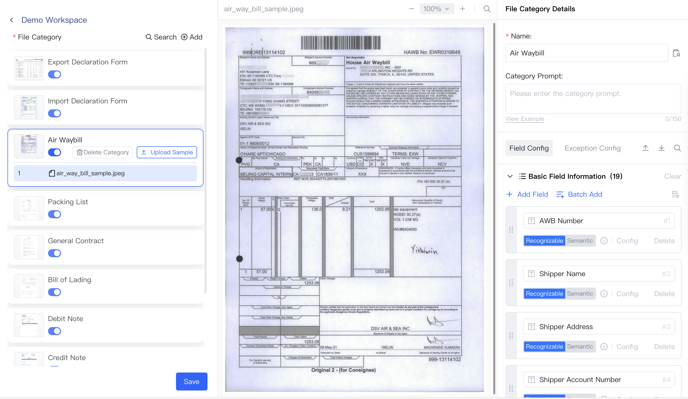
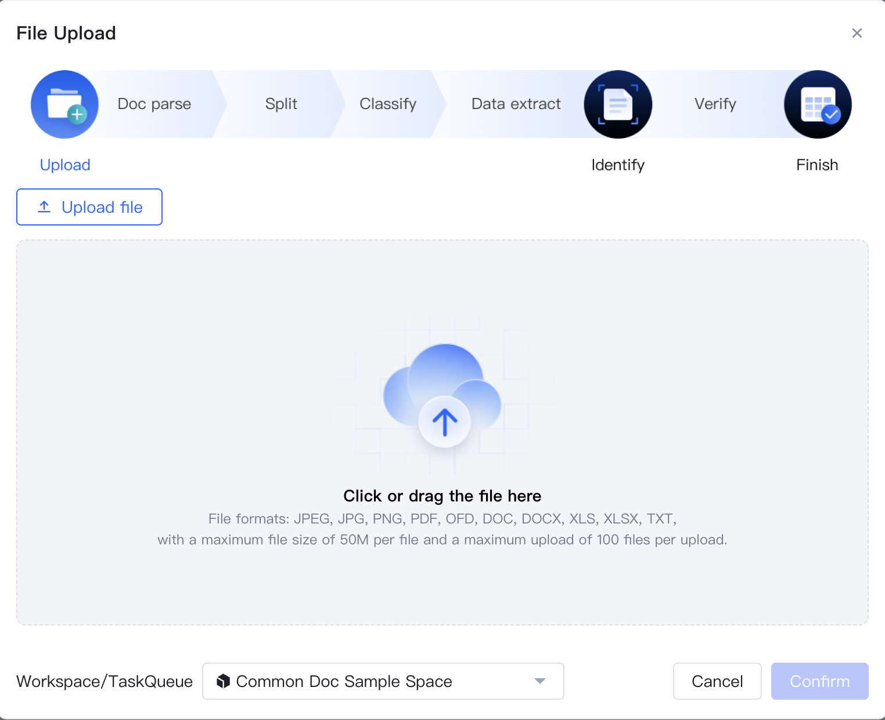
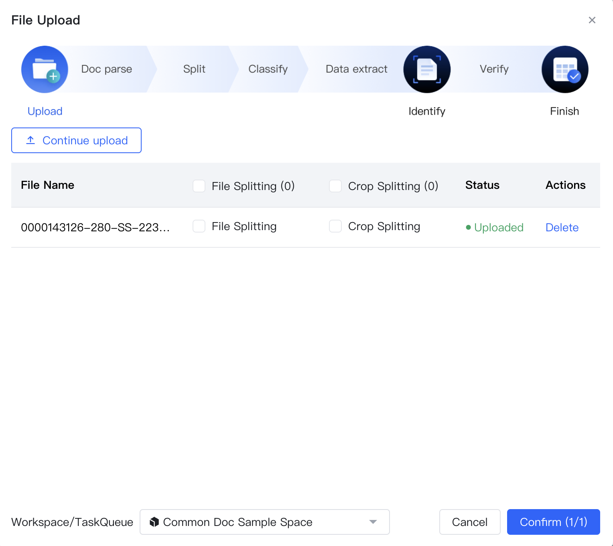
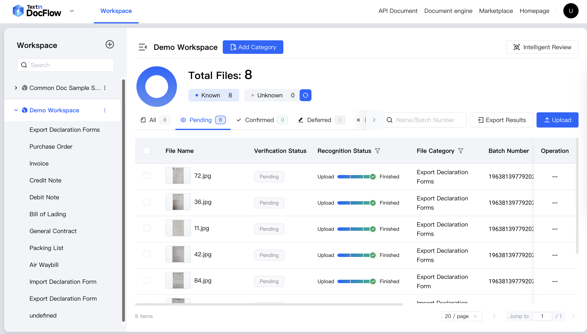
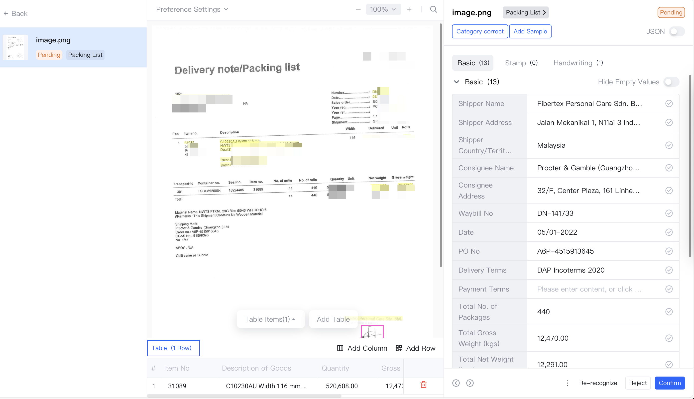
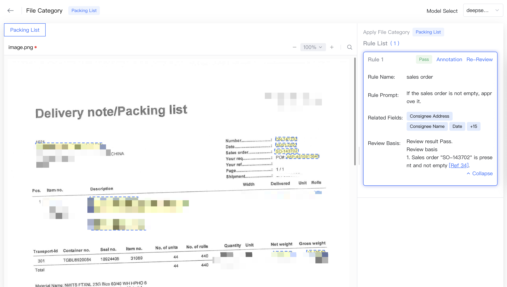

## 01 Product Overview

**Docflow Document Automation Platform** is an AI-powered, enterprise-grade solution from TextIn, a brand of Intsig.

Leveraging Intsig's industry-leading document parsing and understanding capabilities, it supports **intelligent collection**, **document parsing**, **document classification**, **information extraction**, and **intelligent review** of various format documents from both domestic and international sources. It provides efficient and accurate document processing solutions for banking credit, financial shared service centers, logistics customs clearance, insurance claims, and other industry enterprises. Through stable and user-friendly APIs,  you can efficiently integrate DocFlow into various business systems to achieve full-process automation from document collection to information extraction, significantly reducing manual input and review costs.

## 02 Core Value

In today’s era of information overload, organizations must process vast volumes of contracts, invoices, reports, application forms, and other documents every day. Traditional manual processing is time-consuming, labor-intensive, and prone to errors. The **DocFlow Document Automation Platform** enables businesses to tackle document management challenges with ease, significantly enhancing efficiency and data accuracy.

### 2.1 **End-to-End Automation**

- From file upload to output delivery, the entire workflow is handled intelligently by the system with near-zero manual intervention. This significantly accelerates document processing and reduces operational overhead.

### 2.2 **High-Efficiency & High-Accuracy Extraction**

- Processes large volumes of documents within seconds, reducing turnaround time and boosting productivity.
- Powered by advanced large-model capabilities, the platform applies document preprocessing techniques — including image quality optimization and intelligent document structure analysis — to maximize recognition accuracy and meet the demands of diverse usage scenarios.

### 2.3 Intelligent Document Splitting

- For complex files with multiple categories and multiple documents scanned together, as well as single-page documents with multiple tickets pasted together, automatic document splitting, category separation, and recognition are completed, effectively reducing manual splitting costs and improving document processing results.

### 2.4 Intelligent Document Review

- Automated document review is achieved based on document extraction information and review rules. Review results support key review basis echo, effectively improving review result verification efficiency.

### 2.5 Multiple Document Format Compatibility

- Supports processing of ultra-long documents up to 1000 pages
- Supports file formats including JPEG, JPG, PNG, PDF, OFD, DOC, DOCX, XLS, XLSX, TXT,  etc.

### 2.6 On-Demand Customization, Ready to Use

- Personalized configuration: Through uploading custom samples and configuring fields, the system intelligently recognizes file categories and completes structured information extraction
- Efficient comparison and verification: Supports side-by-side viewing of original files and recognition results to ensure information verification and supplementation, meeting personalized needs of different industries.

### 2.7 Powerful Plugin Integration Capabilities

- Accepts input from scanners, email, API endpoints, and other channels. Extracted data can be seamlessly transferred into ERP, RPA, OMS, and other automation systems and business workflows.

## 03 Usage Process

**Docflow Document Automation Platform** aims to simplify document management processes and improve enterprise document processing efficiency. Enterprises only need to complete category information configuration to achieve automated document processing workflow. The specific process is as follows:

### 3.1 Workspace Creation

After logging in, users can create workspaces tailored to specific business scenarios to manage file categories and documents for those scenarios.

### 3.2 File Category Configuration

After completing workspace creation, users can select specific business spaces and configure the following according to business scenario requirements to help the system achieve more accurate automatic classification and field extraction:

1. Create file categories and upload samples
2. Maintain file category classification prompts, field extraction information, etc.

   

### 3.3 File Upload

After completing workspace creation and file category configuration, users can upload documents that need to be processed to the specified workspace through the system platform or API interface. We support automated processing of multiple file format documents, including but not limited to JPEG, JPG, PNG, PDF, OFD, DOC, DOCX, XLS, XLSX, TXT, etc.

### 3.4 Parse

Docflow uses [xParse](https://textin.ai/market/detail/pdf_to_markdown) as its core document parsing service, which can automatically convert user-uploaded PDF, Word, and common image format documents into structured data containing text, tables, title hierarchies, formulas, handwritten characters, and image information for subsequent automated processing and analysis.

### 3.5 File Splitting & Multi-Image Cropping

In practical application scenarios, a document may contain multiple file types. DocFlow provides file splitting and multi-image cropping functions. Users can customize and enable related functions through the system platform or API interface to ensure the accuracy and completeness of document classification and extraction content. For example:

1. Insurance claims scenario: A multi-page PDF may contain identity cards, invoices, bank statements, and other materials at the same time, requiring document page-by-page splitting processing.
2. Financial reimbursement scenario: An A4 paper may have multiple taxi invoices, flight itineraries, and other tickets laid flat, requiring document image cropping processing.

   

### 3.6 Classify

DocFlow automatically classifies parsed documents according to workspace file category configuration information, facilitating users to quickly find and manage, as well as subsequent information extraction and review. Users can also obtain classification results through API interfaces for application in other downstream scenarios.

### 3.7 Extract

DocFlow automatically extracts and displays parsed and classified documents according to field information configured in workspace file categories. Users can obtain document extraction results through the system platform or API interface.

### 3.8 Intelligent Review

Users can create and maintain workspace review rules through the system platform or API interface and initiate review tasks. DocFlow will conduct batch rule review on review task files according to document parsing extraction results and review rules and output review results.

## 04 Try It Now

<CardGroup cols={2}>
  <Card title="SaaS Platform" icon="sparkles" href="https://docflow.textin.ai/">
    One-stop rapid experience of document automation processing workflow
  </Card>
  <Card title="API" icon="sparkles" href="/api-reference/upload-file">
    Offers multi-language support and highly configurable API interfaces.
  </Card>
  <Card title="Docflow Official Website" icon="sparkles" href="https://textin.ai/product/textin_docflow">
    Access more detailed product information here.
  </Card>
  <Card title="Contact Us" icon="sparkles" href="https://textin.ai/contact?type=27&sub_type=1">
    For more partnership information, please contact us.
  </Card>
</CardGroup>