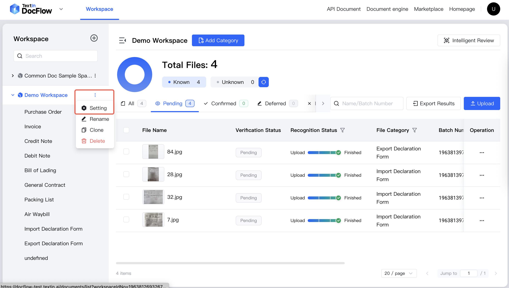
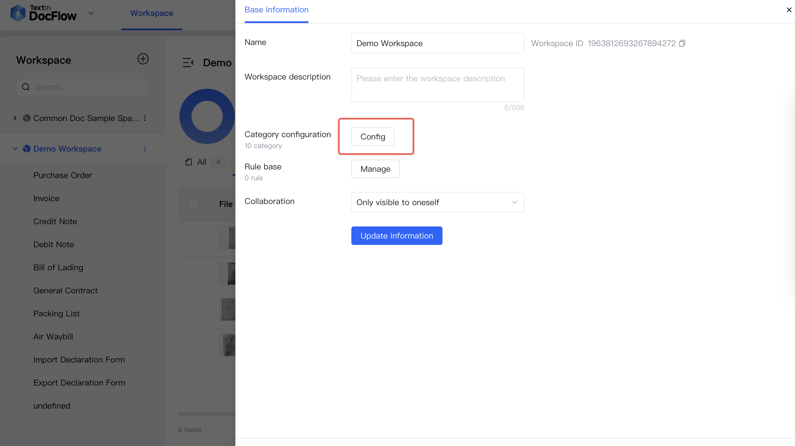
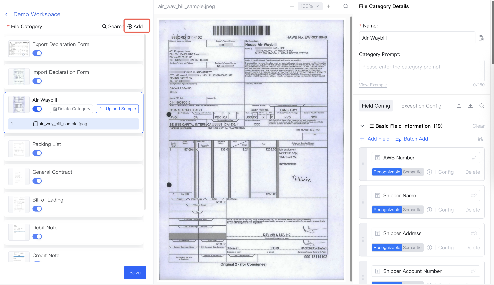
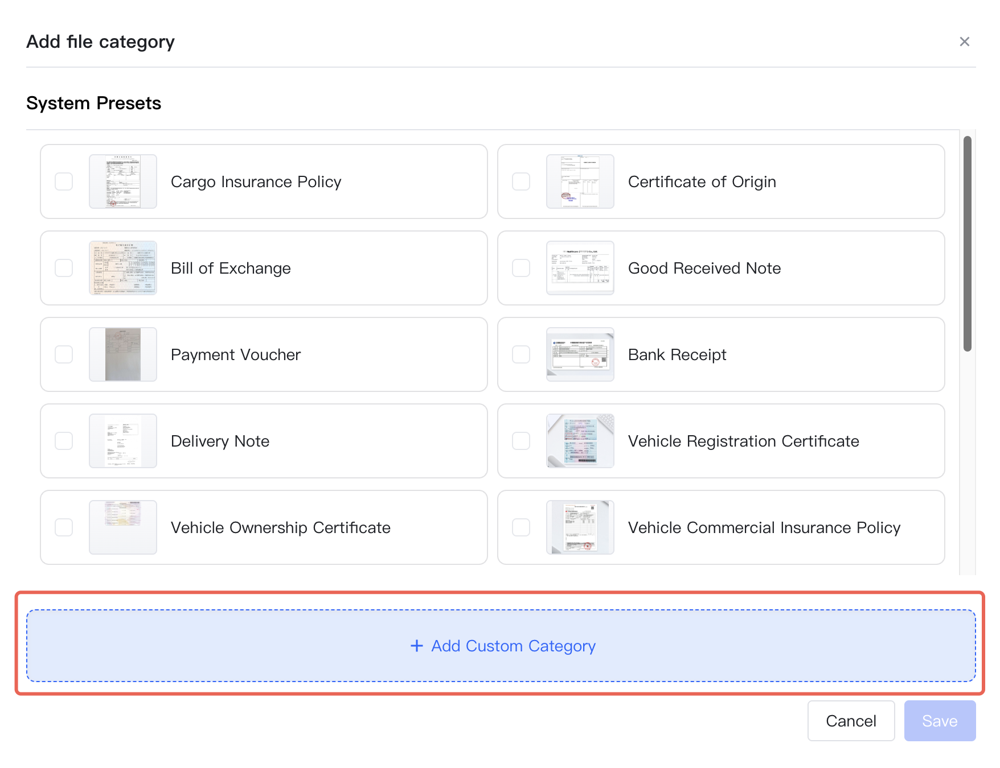
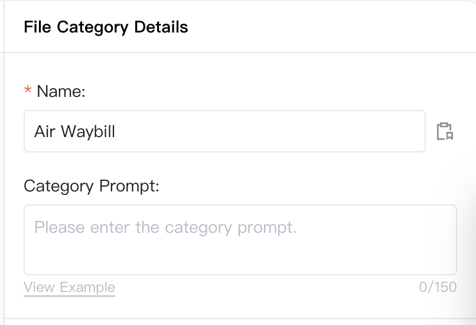
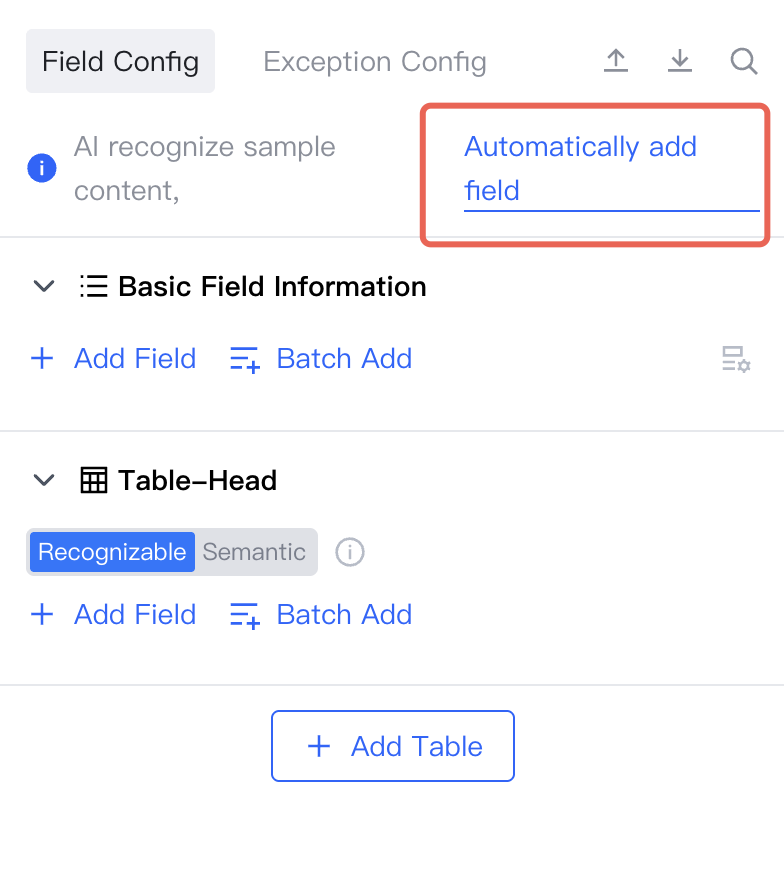
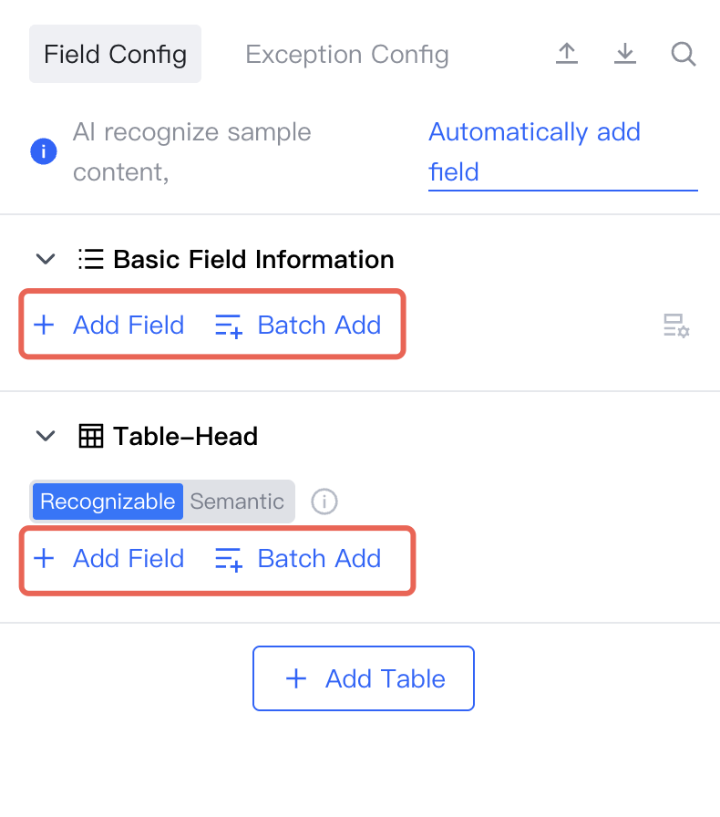
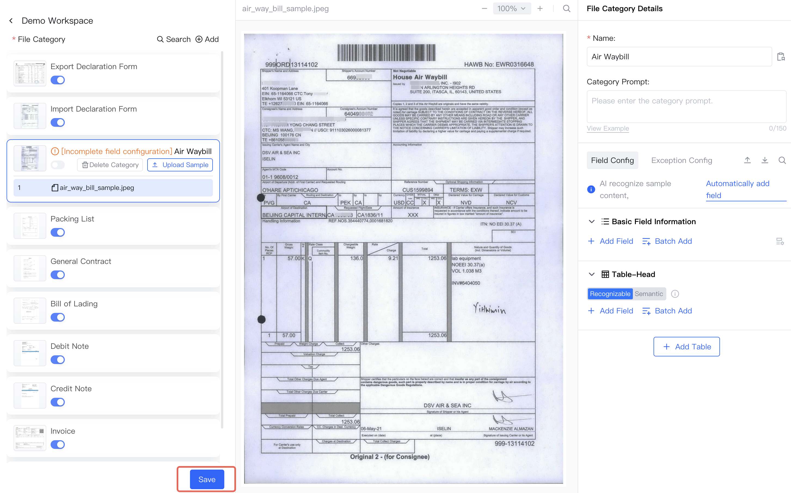

## Category Configuration Page Entry

1. In the workspace list, select a workspace - click **More Actions - Settings**

2. In the pop-up slide window, click category **Configuration** to enter the file category configuration page

## Add Category Sample Files

1. Click **Add Category**

2. Click **Add Custom Category**, upload file

## Configure Classification Name

Set classification name

## Configure Sample Fields

Click **Automatically Add Fields**, AI will automatically add fields based on the document

You can also manually add, adjust, and delete fields

## Save Configuration

Click **Save**

